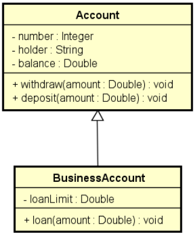

# ExemploHeranca I

Exemplo didático para demonstrar o uso de Herança e modificador de acesso protected em JAVA.

Implementar as classes conforme diagrama apresentado acima, utilizando o recurso de Herança.
Suponha que, para realizar um empréstimo, é descontada uma taxa no valor de $10.0.
